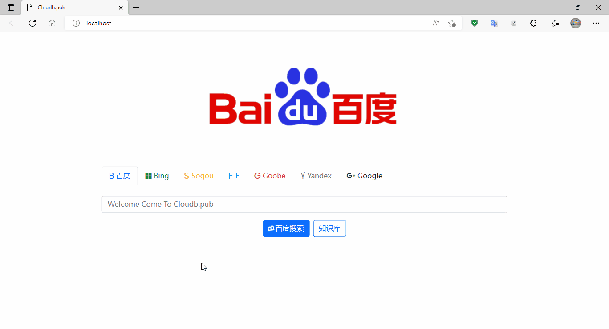

这是一个集成百度,bing,sogou,f,goobe,yandex,google搜索引擎的小project

**起因**: 因为在我自己使用电脑的时候,经常需要去输入搜索引擎地址,而且我自己的个人资料站点也是离线的,所以自己做了这么一个项目.主要是让自己使用起来很方便.

**使用**: 下载项目打开index 既可搜索,知识库其他人忽略即可.如果也想要跟我一样的功能可以参考https://cloudb.pub 源码去设置.知识库我是使用docsify,有些可以使用django,gitbook等工具生成好html页面,我们直接改成index1.html既可以,如果是php,asp等直接修改index里面知识库的a 标签修改超链接路径即可. 

使用参考:

下载本项目中的自解压包search_index.exe ,之后双击解压桌面会生成一个index 的图标,双击打开.

如果提示使用什么软件打开,直接选择edge浏览器打开即可,其次是Google chrome.其他浏览器也可以,但是可能会发生一些糟糕的事情,很多浏览器使用Google chrome低版本内核N次开发,安全补丁不及时更新.

我很爱中国,但是中国的浏览器商根本不爱我,他们只是想从死亡之前的我身上再剥削点什么.