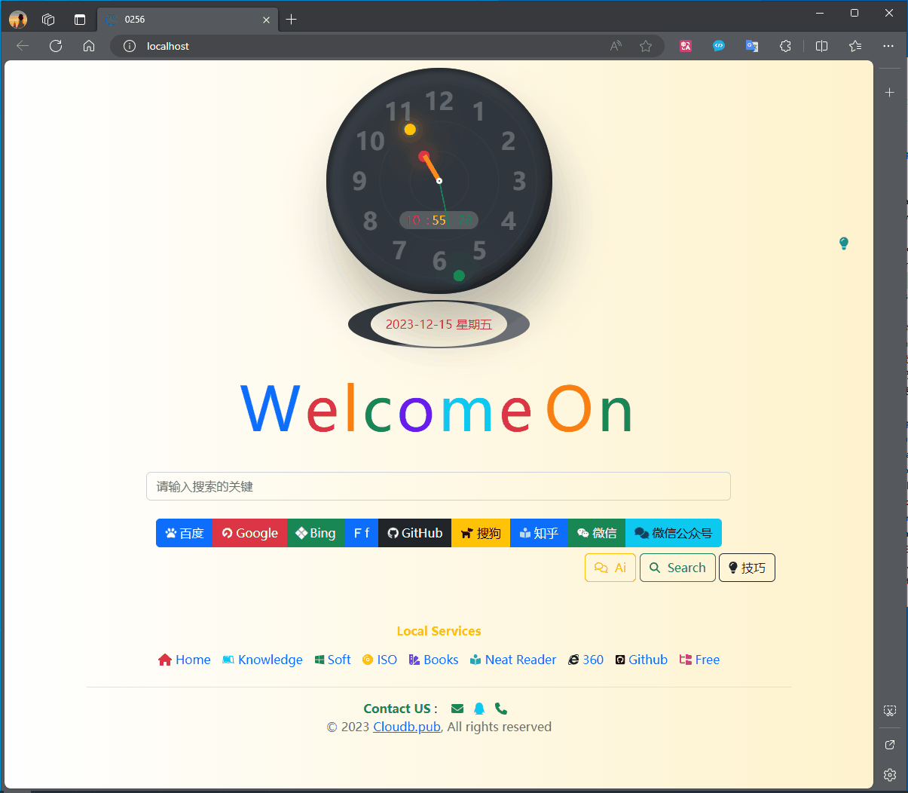

# 项目说明

由于搜索引擎搜索到的内容被和谐,很多时候不得不换很多种搜索引擎来寻找我们想要获取的正确的知识.所以就整合了这套引擎集合.下面是预览图:

里面有免费的Ai

下面导航是我自己的使用中常用到的功能和组件.最下面email qq tel 可以直接联系我.

# 使用

windows四种方式任选

- 下载下来可以直接点击index.html 

- 直接使用我打包好的压缩文件,桌面会创建一个快捷方式双击打开就可以使用了.[弃用]

- 有基础的直接搭建一个web服务器也可以访问

- 实在不想搭建直接使用 https://cloudb.pub  或者 https://xyz349925756.gitee.io

  https://s.0256.website

其他系统

- 搭建 nginx 环境访问即可

> google  这些被限制的需要代理访问.

